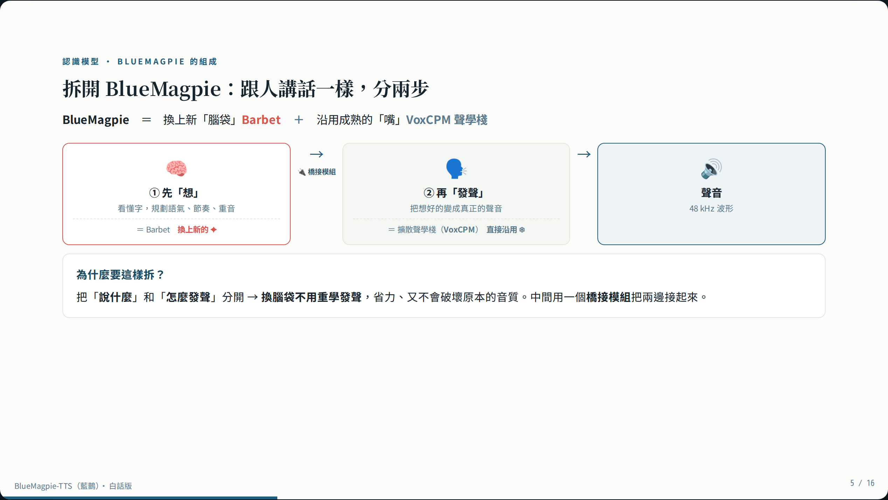
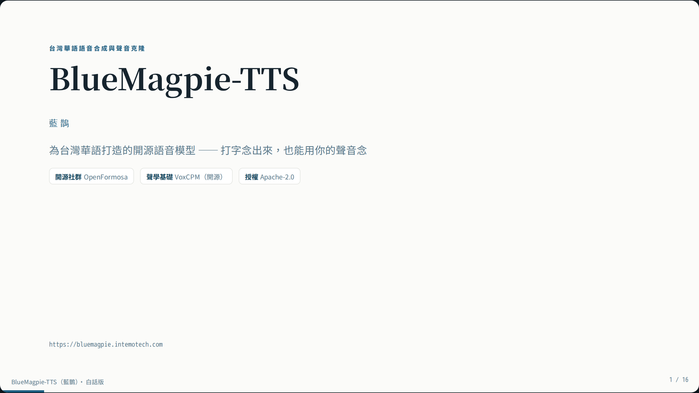
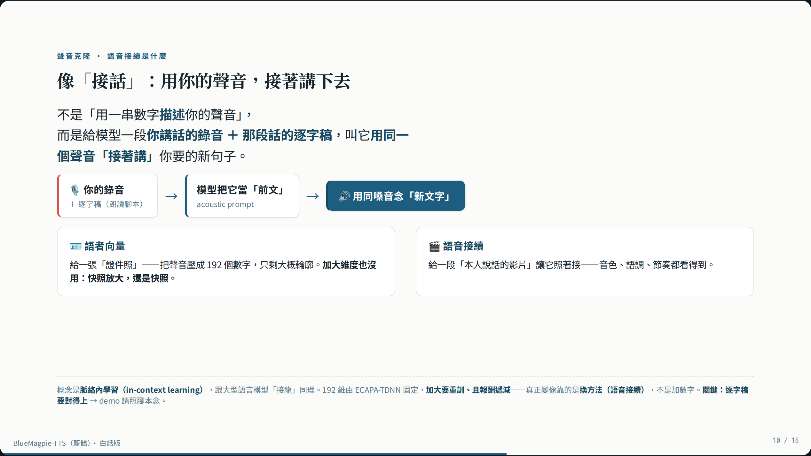

# BlueMagpie-TTS Portal

A demo **web portal** and **FastAPI inference service** for
[OpenFormosa/BlueMagpie-TTS](https://huggingface.co/OpenFormosa/BlueMagpie-TTS) —
an open-source **Taiwanese-Mandarin** text-to-speech & voice-cloning model.

> 🎙️ Live demo (synthesize / clone): **https://bluemagpie.intemotech.com**
> 📊 Slides & presenter script (GitHub Pages): **https://cutedogspark.github.io/bluemagpie-tts-portal/**

This repo is the **serving + UI layer** around the model (not the model itself).
It gives you a clean browser experience and a small HTTP API on top of BlueMagpie-TTS.

## Slide deck preview

A self-contained explainer deck ships in `portal/slides.html` — view it online at
**[cutedogspark.github.io/bluemagpie-tts-portal](https://cutedogspark.github.io/bluemagpie-tts-portal/)**
(`←` / `→` to navigate, `F` for fullscreen):



<p>
  
  
</p>

## Features

- **Text → speech** in Taiwanese Mandarin (48 kHz).
- **Voice cloning**
  - *Voice continuation* (`prompt_wav` + transcript) — the most similar; the UI
    shows a read-aloud script so the transcript is known.
  - *Speaker vector* (`speaker_centroid`, ECAPA-TDNN 192-d) — the original mode.
- **Built-in speakers** with one-click preview.
- **Live GPU monitor** — utilization + this-service memory, polled during synthesis.
- **Adjustable** `cfg_value` (style strength) and `inference_timesteps` (sampling steps).
- **Generation history** for side-by-side comparison; example sentences; mic recording.
- A self-contained **architecture slide deck** (`portal/slides.html`) and presenter
  notes (`portal/script.html`).

## Layout

```
inference/   FastAPI service: loads BlueMagpieModel, exposes /api/tts, /api/clone,
             /api/speakers, /api/gpu, /healthz. Generation is serialized (one GPU job
             at a time); heavy imports are lazy; tests use a fake model service.
portal/      Static SPA (no framework) + Playwright tests + the slide deck.
```

## Architecture (high level)

```
Browser ──HTTPS──▶ static portal + reverse proxy ──▶ FastAPI service on a GPU host
                                                        └─ BlueMagpieModel (CUDA)
```

The front end is static and talks to the service via `/api/*` (same-origin through a
reverse proxy). The model service binds to a private interface and is not exposed
publicly. Configure the model location with `BLUEMAGPIE_MODEL_DIR` (or let it download
from Hugging Face with `HF_TOKEN`).

## Quick start

### 1. Inference service

```bash
cd inference
uv venv && uv pip install -e ".[dev]"
# install the model package (see https://github.com/OpenFormosa/BlueMagpie-TTS)
#   pip install -e "/path/to/BlueMagpie-TTS[clone]"
# get the weights (other machine, then copy):  python scripts/download_model.py
export BLUEMAGPIE_MODEL_DIR=/path/to/BlueMagpie-TTS   # offline weights
uv run uvicorn app.main:app --host 127.0.0.1 --port 8020
```

Run the tests (they use a fake model, no GPU needed):

```bash
cd inference && uv run pytest -q
```

### 2. Portal

Serve the `portal/` directory with any static server, and reverse-proxy `/api/*`
to the inference service. Front-end tests:

```bash
cd portal && npm install && npx playwright test
```

## API

| Endpoint | Purpose |
|---|---|
| `GET /healthz` | model ready state |
| `GET /api/speakers` | list built-in speakers |
| `POST /api/tts` | `{text, cfg_value, inference_timesteps, speaker?}` → mp3 |
| `POST /api/clone` | multipart `{consent, text, mode, prompt_text?, audio, …}` → mp3 |
| `GET /api/gpu` | live GPU stats (nvidia-smi + torch) |

## Credits

- **Model:** [OpenFormosa BlueMagpie-TTS](https://huggingface.co/OpenFormosa/BlueMagpie-TTS)
- **Acoustic stack:** [VoxCPM](https://github.com/OpenBMB/VoxCPM) (OpenBMB)
- **Speaker encoder:** ECAPA-TDNN (SpeechBrain)
- **Portal & service author:** Gary Chen

## License

MIT — see [LICENSE](LICENSE). The underlying model and its components carry their
own licenses (BlueMagpie-TTS / VoxCPM are Apache-2.0).

> ⚠️ Voice cloning is for your own voice or voices you are authorized to use.
> Do not use it for impersonation, fraud, or any unauthorized purpose.
